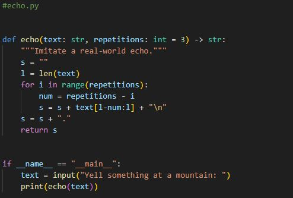
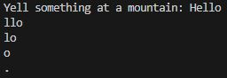
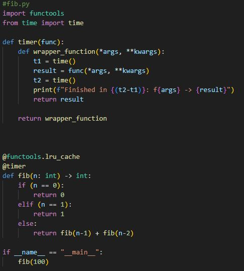
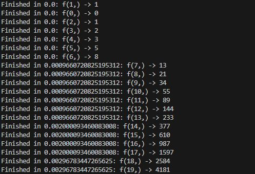
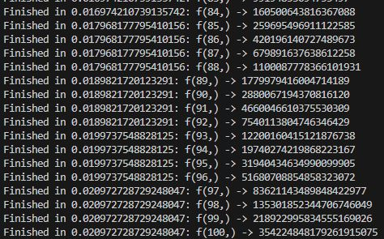
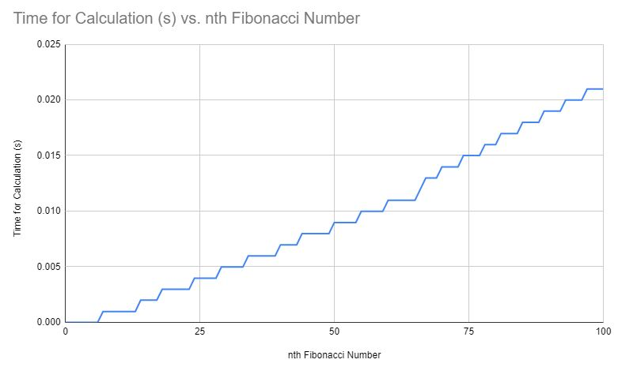

# CS3980-HW1
This is the README file for the first assignment in CS:3980 for the Spring 2024 semester.

## echo.py

Echo.py is meant to imitate a real-world echo from a mountain top. When the program is run, the user gives a string, 
and the last three characters are 'echoed' back, followed by the last two, and finally the last character of the string.
After the string has 'echoed' a '.' is printed to signify the end of the echo.

The number of characters repeated in the echo can be changed by changing the 'repetitions' int in the echo function.

## fib.py

Fib.py gives the first 100 numbers in the Fibonacci sequence by recursively calculating them. 
A LRU cache from functools is used to optimize runtime. A timer decorator is implemented to calculate the runtime 
for the calculation of each Fibonacci number. 

### fib.py graph
A graph representing the runtime for each Fibonacci number is shown above. Note how as the nth Fibonacci is calculated, the runtime increases.
